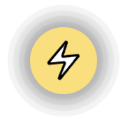

<p align="center">
  
</p>

# boost-button

React component that allows you to integrate a boost button into your web application, leveraging [webln](https://www.webln.guide/introduction/readme) for boosting people with lightning addresses.

## 🚀 Quick Start

```
npm install boost-button
```

## 🤙 Usage

### `BoostButton`


```jsx
import React from 'react';
import { BoostButton } from 'boost-button';

const MyComponent = () => {
  const lnurl = 'hello@getalby.com';

  return (
    <div>
      <h1>My LN App</h1>
      <BoostButton lnurl={lnurl} />
    </div>
  );
};

export default MyComponent;
```

And Boost Button component would be embedded like this:


### `injectBoostButton`

```jsx
import { injectBoostButton } from 'boost-button';

const lnurl = 'hello@getalby.com';

injectBoostButton(lnurl);

```

And you should see the Boost Button widget on the bottom right of your app:



## Thanks

@bigyanpoudel for https://github.com/bigyanpoudel/react-vite-library